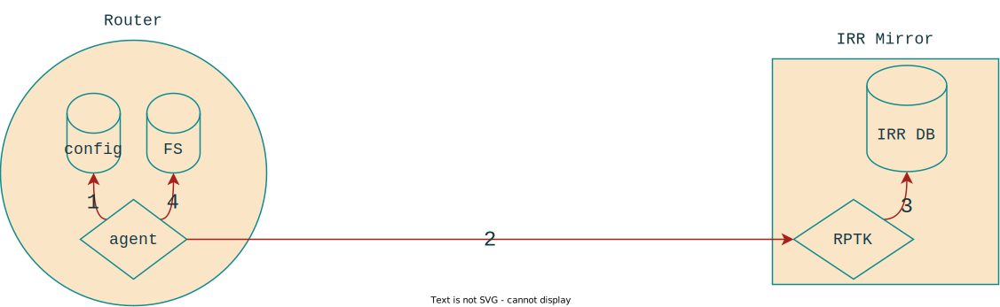

<!-- _class: lead invert -->
# BGP Filtering at Workonline

***Adventures in router OS customisation***

**Ben Maddison**
[*benm@workonline.africa*](mailto:benm@workonline.africa)

# Background: Ingress policy anatomy

In general, from an external BGP neighbour:

- discard *martian* prefixes and `AS_PATH`s
- discard RPKI ROV Invalid paths
- discard local prefixes
- prune and process BGP communities
- accept **IRR-registered** prefixes up to `max-prefix` limit

# Background: the IRR system

A collection of **RPSL** object databases

- Independently operated
- Loosely co-ordinated
- Varying degrees of authentication
- Varying degrees of hygiene
- Operated by the 5 RIRs & several 3rd party operators (Merit, NTT, Level3, etc)

# Background: IRR-generated prefix-lists

Uses `as-set`, `aut-num`, `route` and `route6` objects:

<!-- markdownlint-disable line_length -->
0. Begin with `as-set` name
1. Recursively look-up members of each set encountered using `members:` attribute
2. For each `aut-num` object found in #1, search for `route`/`route6` objects with matching `origin:` attribute
<!-- markdownlint-restore -->

# Key points

- IRR generated lists can be **large**
- IRR generated lists depend on the data that exists at the time of generation
- IRR data is messy

<!-- markdownlint-disable-next-line MD026 -->
# The early days!

``` figure
       -- HTTP request ->          -- IRR queries ->
| R1 |                    | prov |                   | IRR Mirror |
       <- TCL script ----          <- query resp. --
```

- `alias` configured on the local router sources and execs TCL script
- `prov` runs a perl CGI service:
  - queries an IRR Mirror
  - dynamically writes a TCL script
- returned script writes the local running-config using `ip prefix-list ...` commands

# Config provisioning at AS37271

Since approx 2017, 100% of network configuration has been automated

- generated from version-controlled, structured data
- vendor agnostic data -> vendor specific templates
- tested for schema correctness and business rules
- tested for key functional properties (routing policy, etc)
- resulting device config `diff` reviewed by an engineer
- deployed using a **configuration replacement** strategy

# Config provisioning + IRR-data

Initial approach:

- build filter generation using custom config template logic
- ship updated filters whenever a new config is deployed

# Config provisioning + IRR-data (cont.)

Operational headaches:

- external IRR data breaks reproducibility
- external data changes make deviations hard to detect
- prefix-list differences make config diffs noisy and hard to review
- large filters makes deployment slooooow :(

# Solutions?

IRR-generated list timed caching

Pros:

- Reduces configuration churn and diff noise
- Implemented entirely off-box

Cons:

- Doesn't fix reproducibility
- Doesn't fix deployment time

# Solutions (cont.)

Management/policy-plane separation

- Only filter *existence* is in the running-config
- Filter *content* is managed independently
- Familiar to anyone that has used RPKI-RTR

# Complications

Router OS support requirements:

<!-- markdownlint-disable line_length -->
- API-driven configuration inspection / replacement
- 3rd-party process runtime
- Efficient "external" configuration incorporation (e.g. EOS URL-based prefix-lists, JUNOS ephemeral DB, etc)
<!-- markdownlint-restore -->

# Gen1 - EOS Prefix-List Agent

<https://wolcomm.github.io/eos-prefix-list-agent>

- Written in python
- Runs on Arista devices, as an **EOS Agent**
- Uses EOS-SDK runtime
- In production at Workonline since 2019

<!-- markdownlint-disable no-duplicate-heading line_length ol-prefix -->
# EOS Prefix-List Agent operation



1. Inspect the `running-config` to determine which prefix-lists to build

# EOS Prefix-List Agent operation


2. Query the [RPTK] HTTP API to retrieve list contents

[RPTK]: https://github.com/wolcomm/rptk

# EOS Prefix-List Agent operation


3. RPTK queries local IRR database (using `bgpq3` under the hood)

# EOS Prefix-List Agent operation


4. Agent writes the prefix-list contents out to the local filesystem, and pokes EOS to read
<!-- markdownlint-restore -->

# What's this RPTK thing for?

Dealing with IRR filter generation is harder than it looks:

- Queries need to be **pipelined** to reduce latency
- Returned sets need to be aggregated, to keep sizes down

Only `bgpq3`/`bgpq4` implements these well.

RPTK provides a web-service which wraps `bgpq3` on the server side.

# Gen2 - Introducing BGPfu

Project goals:

- Re-implement the basic building blocks of `bgpq3` as library code [*done*]
- Write `bgpq4`-style alternative tool [*in progress*]
- Implement prefix-list builder for JUNOS [*in progress*]
- Produce an alternative to IRRd4 for read-only IRR mirroring [*starting 2024*]

# Building blocks

- `irrc-rs` <https://github.com/wolcomm/irrc-rs>
  IRRd query protocol client library, with query pipelining
- `rpsl-rs` <https://github.com/wolcomm/rpsl-rs>
  RPSL syntax parser, AST and expression evaluation library
- `generic-ip-rs` <https://github.com/wolcomm/generic-ip-rs>
  IP address type library, including IP prefix set data structures

# Project status

<https://github.com/bgpfu/bgpfu-rs>

- Working RPSL expression evaluation tool (`bgpfu-cli`)
  - needs support for `AS_PATH` filters
  - needs contributions for vendor config dialects
- Working JUNOS prefix-list-agent (`bgpfu-junos-agent`)
  - release pending some bug fixes in JUNOS
  - FreeBSD experts welcome to provide build-pipeline knowledge
  - port to JUNOS Evo planned for early late 2023

# FIN

demos available on request in the bar ;-)
<!-- _class: lead invert -->
